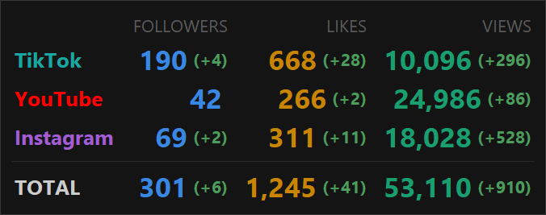

# Social Tray Widget

A lightweight Windows system-tray widget that shows your **TikTok + YouTube + Instagram + Telegram** followers, views, and likes side by side — right on the taskbar.



Every platform is read through its **official API** — OAuth for TikTok, YouTube and Instagram, an MTProto user session for Telegram. Nothing here scrapes a page or replays a private endpoint, so nothing here gets you rate-limited or banned.

---

## Features

- Two tray icons: **Σ followers** · **Σ views** — click either for the detail popup
- One table for all four platforms, plus totals: followers · views · likes
- **Deltas**: green `(+12)` / red `(-3)` next to every value, counting from the last time you acknowledged them. Click the popup to rebase — the deltas survive restarts
- Flip-digit animation in the popup (Solari board style)
- Sound notification on new followers (configurable WAV, mutable from the tray)
- Enable/disable any platform from the tray menu
- Tokens refresh themselves — after setup you never touch a developer console again
- One provider class per platform: adding a fourth is one file plus one line

---

## Requirements

- Windows 10/11
- Python 3.10+
- A developer app per platform you enable (see **Setup**)

```
pip install -r requirements.txt
```

---

## Setup

Copy `settings.json.example` to `settings.json`, then fill in only the platforms you want. `settings.json`, `tokens/` and `state.json` are all in `.gitignore` — no credential is ever committed.

Run with `start.bat`, or:

```
python run.py
```

### TikTok

Create an app at [developers.tiktok.com](https://developers.tiktok.com/) with the scopes `user.info.basic`, `user.info.profile`, `user.info.stats`, `video.list`, and the redirect URI `http://localhost:8080/callback`. Put the **Client Key** and **Client Secret** into `settings.json`. The first run opens a browser.

### YouTube

Create a Google Cloud project, enable **YouTube Data API v3**, and make an OAuth client of type *Web application* with the redirect URI `http://localhost:8080/callback`. Put the **Client ID** and **Client Secret** into `settings.json`. The first run opens a browser.

> **Publish the consent screen.** While it sits in *Testing* mode Google expires refresh tokens after 7 days and every poll then dies with `invalid_grant`.

YouTube rounds the public subscriber count to 3 significant figures — the API can't return the exact number even to the channel owner.

### Instagram

The account must be **professional** (Business or Creator) and **public**.

1. Create a Meta app at [developers.facebook.com](https://developers.facebook.com/) and add the **Instagram API with Instagram Login** product.
2. **Roles** tab → grant the account the *Instagram Tester* role. Then accept the invite from the account itself: Instagram → Settings → Apps and websites → Tester invites.
3. **Instagram → API setup with Instagram login → Generate access tokens** → copy the token into `providers.instagram.setup_token`.

That's it — no app secret, no redirect URI, no browser flow. The dashboard token is already valid for 60 days; the widget adopts it on first run, moves it to `tokens/instagram.json`, blanks `setup_token`, and refreshes it from then on.

### Telegram

Bot API exposes neither post views nor reactions, so this provider signs in as **you** over MTProto and reads what the Telegram apps show.

1. Get **api_id** and **api_hash** at [my.telegram.org](https://my.telegram.org/) → API development tools (Short name is strictly alphanumeric).
2. Put them and the channel's `@username` into `providers.telegram` in `settings.json`. A private channel needs its numeric `-100…` id instead, and the signed-in account must be able to see it.
3. Run `python telegram_login.py` in a real terminal and sign in with the phone number + the code Telegram sends (and the 2FA password, if set). This writes `tokens/telegram.session`; the widget itself never prompts. Any Python 3.10+ will do — the script re-launches itself inside the app's own `.venv`, creating it and installing the requirements on first use.

> **The session file is a password.** `tokens/telegram.session` grants full access to the account — it lives in the gitignored `tokens/` folder; don't copy it anywhere. Revoking it (Telegram → Settings → Devices) just means running `telegram_login.py` once more.

<details>
<summary><b>Instagram troubleshooting</b> — three errors that look like something else</summary>

| Error | What it actually means |
|---|---|
| `Session key invalid … code 452` when exchanging the token | The token is **already long-lived**; this product has no short-lived stage and nothing to exchange. Just paste it into `setup_token` and let the widget adopt it. Don't call `ig_exchange_token`. |
| `UserInvalidCredentials` at the dashboard login | The account has no native Instagram password because it signs in through Facebook. Set one: Accounts Center → Password and security. |
| `OAuthException: your account's future activity history off Meta technologies is currently turned off` | Turn **off** "Disconnect future activity" in Accounts Center → Your activity off Meta technologies. Leave it off — it breaks token refresh too. |

Posts made before the account switched to professional never report insights, so their views can't be counted — the widget detects them once and skips them afterwards.
</details>

---

## Settings reference

| Key | Default | Description |
|-----|---------|-------------|
| `poll_interval` | `60` | Seconds between polls |
| `sound_enabled` | `true` | Play a sound on new followers |
| `sound_volume` | `1.0` | Playback volume (0.0 – 1.0) |
| `sound_followers` | `snd/2.wav` | WAV played when followers increase |
| `color_subs` | `[57,135,229]` | RGB of the followers column and tray icon |
| `color_views` | `[25,158,112]` | RGB of the views column and tray icon |
| `color_likes` | `[201,133,0]` | RGB of the likes column |

Per platform, under `providers.<name>`:

| Key | Platforms | Default | Description |
|-----|-----------|---------|-------------|
| `enabled` | all | `false` | Also toggleable from the tray menu |
| `color` | all | — | RGB of the platform's name in the popup |
| `client_key` / `client_secret` | tiktok | — | From the TikTok app |
| `client_id` / `client_secret` | youtube | — | From the Google OAuth client |
| `redirect_uri` | tiktok, youtube | `http://localhost:8080/callback` | Must match the console exactly |
| `setup_token` | instagram | — | Dashboard token; consumed on first run |
| `api_id` / `api_hash` | telegram | — | From my.telegram.org |
| `channel` | telegram | — | `@username`, or `-100…` id for a private channel |
| `proxy` | telegram | `""` | Empty = follow the Windows system proxy (for ISPs that block MTProto directly); `none` = force direct; or `socks5://host:port` |
| `count_views` | tiktok, instagram, telegram | `true` | Off = skip the views calls |
| `views_refresh_min` | instagram, telegram | `15` | Minutes between views/likes passes |
| `count_likes` | youtube | `true` | Off = skip the uploads walk |
| `likes_refresh_min` | youtube | `15` | Minutes between likes passes |

---

## Tray menu

Right-click either tray icon:

- **Platforms** — enable/disable each source (saved to `settings.json`)
- **Refresh now** — poll immediately
- **Sound: ON/OFF** — mute the follower sound
- **Exit**

---

## How it stays inside the rate limits

Followers cost one call per platform and stay live at `poll_interval`. Views and likes are the expensive ones, so each is cached for `views_refresh_min` / `likes_refresh_min` minutes:

- **YouTube** has no channel-level like total, so likes mean walking the uploads playlist 50 videos at a time — `2 × ceil(uploads / 50)` units of the 10,000/day quota per pass. Beware that `statistics.videoCount` counts only *public* videos and understates this badly: a channel reporting 133 can hold 300+ items in its uploads playlist. Once a minute that alone would exhaust the quota; every 15 minutes it lands near a quarter of it.
- **Instagram**'s limit is `4800 × impressions per 24h`, so a quiet account has a small budget. Views come from `/insights` (the documented `view_count` field on the media node is silently omitted by this product), batched 50 posts per call via `?ids=`. A pass costs 2 calls, not 50.
- **Telegram** views and reactions mean walking the channel history, which Telethon paces at one 100-post request per second. The full walk is paid once at setup and then once a day; in between, a pass reads only posts newer than the last one seen — usually a single request.

## Colours

The palette is validated, not eyeballed: every colour sits inside the OKLCH lightness band for the popup's `#141414` surface, clears the chroma floor and 3:1 contrast, and stays distinct under protanopia and deuteranopia. Only YouTube keeps its brand red — TikTok wears its other brand colour (cyan, darkened to fit the band) and Instagram the violet end of its gradient, because all three brand reds together read as one wash. Colour encodes the *metric*: a column is one hue top to bottom. The platform's name carries its identity. If you change these, re-check them rather than trusting your eye.

---
---

# Social Tray Widget (на русском)

Лёгкий виджет для системного трея Windows: показывает **TikTok + YouTube + Instagram + Telegram** — подписчиков, просмотры и лайки — рядом, прямо на панели задач.


Каждая платформа читается через **официальный API** — OAuth у TikTok, YouTube и Instagram, пользовательская MTProto-сессия у Telegram. Здесь нет скрейпинга страниц и обращений к приватным эндпоинтам, поэтому нет ни банов, ни блокировок по частоте.

---

## Возможности

- Две иконки в трее: **Σ подписчики** · **Σ просмотры** — клик открывает попап
- Одна таблица на все четыре платформы плюс итоги: подписчики · просмотры · лайки
- **Дельты**: зелёное `(+12)` / красное `(-3)` рядом с каждым числом, считаются с момента последнего подтверждения. Клик по попапу перебазирует; дельты переживают перезапуск
- Анимация цифр в стиле табло Solari
- Звук при новых подписчиках (настраиваемый WAV, мьютится из трея)
- Включение/выключение любой платформы из меню трея
- Токены обновляются сами — после настройки в консоль разработчика больше не возвращаешься
- Один класс на платформу: добавить четвёртую — это один файл и одна строка

---

## Требования

- Windows 10/11
- Python 3.10+
- Приложение разработчика для каждой включаемой платформы (см. **Настройка**)

```
pip install -r requirements.txt
```

---

## Настройка

Скопируйте `settings.json.example` в `settings.json` и заполните только нужные платформы. `settings.json`, `tokens/` и `state.json` прописаны в `.gitignore` — ключи никогда не попадут в репозиторий.

Запуск через `start.bat`, или вручную:

```
python run.py
```

### TikTok

Создайте приложение на [developers.tiktok.com](https://developers.tiktok.com/) со скоупами `user.info.basic`, `user.info.profile`, `user.info.stats`, `video.list` и redirect URI `http://localhost:8080/callback`. Впишите **Client Key** и **Client Secret** в `settings.json`. При первом запуске откроется браузер.

### YouTube

Создайте проект в Google Cloud, включите **YouTube Data API v3**, создайте OAuth-клиент типа *Web application* с redirect URI `http://localhost:8080/callback`. Впишите **Client ID** и **Client Secret** в `settings.json`. При первом запуске откроется браузер.

> **Опубликуйте consent screen.** Пока он в режиме *Testing*, Google убивает refresh-токены через 7 дней, и каждый опрос падает с `invalid_grant`.

YouTube округляет публичное число подписчиков до 3 значащих цифр — точное значение API не отдаёт даже владельцу канала.

### Instagram

Аккаунт должен быть **профессиональным** (Business или Creator) и **открытым**.

1. Создайте приложение на [developers.facebook.com](https://developers.facebook.com/) и добавьте продукт **Instagram API with Instagram Login**.
2. Вкладка **Roles** → выдайте аккаунту роль *Instagram Tester*. Затем примите приглашение из самого аккаунта: Instagram → Настройки → Приложения и сайты → приглашения тестировщика.
3. **Instagram → API setup with Instagram login → Generate access tokens** → скопируйте токен в `providers.instagram.setup_token`.

Всё — ни app secret, ни redirect URI, ни браузера. Токен из дашборда уже действует 60 дней: виджет принимает его при первом запуске, переносит в `tokens/instagram.json`, затирает `setup_token` и дальше продлевает сам.

### Telegram

Bot API не отдаёт ни просмотры постов, ни реакции, поэтому этот провайдер входит по MTProto **от вашего имени** и читает то же, что видят приложения Telegram.

1. Получите **api_id** и **api_hash** на [my.telegram.org](https://my.telegram.org/) → API development tools (Short name — строго буквы и цифры).
2. Впишите их и `@имя` канала в `providers.telegram` в `settings.json`. Приватному каналу нужен числовой id `-100…`, и аккаунт должен его видеть.
3. Запустите `python telegram_login.py` в обычном терминале и войдите: номер телефона + код из Telegram (и пароль 2FA, если включён). Скрипт запишет `tokens/telegram.session`; сам виджет никогда ничего не спрашивает. Подойдёт любой Python 3.10+ — скрипт сам перезапустится в собственном окружении приложения (`.venv`), при первом использовании создав его и установив зависимости.

> **Файл сессии — это пароль.** `tokens/telegram.session` даёт полный доступ к аккаунту — он лежит в игнорируемой git-ом папке `tokens/`; не копируйте его никуда. Если сессию отозвали (Telegram → Настройки → Устройства), просто запустите `telegram_login.py` ещё раз.

<details>
<summary><b>Instagram: разбор ошибок</b> — три штуки, которые означают не то, что написано</summary>

| Ошибка | Что на самом деле |
|---|---|
| `Session key invalid … code 452` при обмене токена | Токен **уже долгоживущий**; в этом продукте нет короткой стадии и менять нечего. Просто вставьте его в `setup_token`. `ig_exchange_token` вызывать не нужно. |
| `UserInvalidCredentials` при логине в дашборде | У аккаунта нет собственного пароля Instagram, вход идёт через Facebook. Задайте пароль: Accounts Center → Пароль и безопасность. |
| `OAuthException: your account's future activity history off Meta technologies is currently turned off` | Выключите «Disconnect future activity» в Accounts Center → Ваша активность вне технологий Meta. И не включайте обратно — это ломает и продление токена. |

Посты, опубликованные до перехода аккаунта на профессиональный, статистику не отдают никогда, поэтому их просмотры не считаются — виджет определяет их один раз и дальше пропускает.
</details>

---

## Описание настроек

| Ключ | По умолчанию | Описание |
|------|-------------|----------|
| `poll_interval` | `60` | Интервал опроса в секундах |
| `sound_enabled` | `true` | Звук при новых подписчиках |
| `sound_volume` | `1.0` | Громкость (0.0 – 1.0) |
| `sound_followers` | `snd/2.wav` | WAV при росте подписчиков |
| `color_subs` | `[57,135,229]` | RGB колонки подписчиков и иконки в трее |
| `color_views` | `[25,158,112]` | RGB колонки просмотров и иконки в трее |
| `color_likes` | `[201,133,0]` | RGB колонки лайков |

По платформам, в секции `providers.<имя>`:

| Ключ | Платформы | По умолчанию | Описание |
|------|-----------|-------------|----------|
| `enabled` | все | `false` | Переключается и из меню трея |
| `color` | все | — | RGB названия платформы в попапе |
| `client_key` / `client_secret` | tiktok | — | Из приложения TikTok |
| `client_id` / `client_secret` | youtube | — | Из OAuth-клиента Google |
| `redirect_uri` | tiktok, youtube | `http://localhost:8080/callback` | Должен точно совпадать с консолью |
| `setup_token` | instagram | — | Токен из дашборда, тратится при первом запуске |
| `api_id` / `api_hash` | telegram | — | С my.telegram.org |
| `channel` | telegram | — | `@имя`, либо id `-100…` для приватного канала |
| `proxy` | telegram | `""` | Пусто = системный прокси Windows (если провайдер режет MTProto напрямую); `none` = принудительно напрямую; либо `socks5://host:port` |
| `count_views` | tiktok, instagram, telegram | `true` | Выкл = не запрашивать просмотры |
| `views_refresh_min` | instagram, telegram | `15` | Минуты между проходами за просмотрами/лайками |
| `count_likes` | youtube | `true` | Выкл = не обходить плейлист загрузок |
| `likes_refresh_min` | youtube | `15` | Минуты между проходами за лайками |

---

## Меню трея

Правой кнопкой по любой иконке:

- **Platforms** — включить/выключить источник (сохраняется в `settings.json`)
- **Refresh now** — обновить немедленно
- **Sound: ON/OFF** — мьют звука подписчиков
- **Exit** — выход

---

## Как виджет укладывается в лимиты

Подписчики стоят один запрос на платформу и обновляются живьём каждый `poll_interval`. Просмотры и лайки — дорогие, поэтому кэшируются на `views_refresh_min` / `likes_refresh_min` минут:

- **У YouTube** нет суммы лайков на уровне канала, поэтому лайки — это обход плейлиста загрузок по 50 видео: `2 × ceil(загрузок / 50)` единиц квоты (10 000/сутки) за проход. Осторожно: `statistics.videoCount` считает только **публичные** видео и сильно занижает картину — канал, показывающий 133, легко держит 300+ элементов в плейлисте загрузок. Раз в минуту это выело бы всю квоту в одиночку; раз в 15 минут — около четверти.
- **У Instagram** лимит `4800 × показы за 24 часа`, так что у тихого аккаунта бюджет маленький. Просмотры берутся из `/insights` (задокументированное поле `view_count` у media-ноды этот продукт молча не возвращает), пачками по 50 постов через `?ids=`. Проход стоит 2 запроса, а не 50.
- **У Telegram** просмотры и реакции — это обход истории канала, который Telethon сам замедляет до одного запроса (100 постов) в секунду. Полный обход оплачивается один раз при настройке и затем раз в сутки; между ними проход читает только посты новее последнего увиденного — обычно один запрос.

## Цвета

Палитра проверена, а не подобрана на глаз: каждый цвет попадает в полосу светлоты OKLCH для фона попапа `#141414`, проходит порог насыщенности и контраст 3:1 и остаётся различимым при протанопии и дейтеранопии. Красный сохранил только YouTube — TikTok носит свой второй фирменный цвет (циан, притемнённый под полосу), а Instagram фиолетовый край своего градиента: три фирменных красных вместе сливаются в одно пятно. Цвет кодирует **метрику** — колонка одного оттенка сверху донизу. Название платформы отвечает за опознание. Если меняете — перепроверяйте, а не доверяйтесь глазу.
